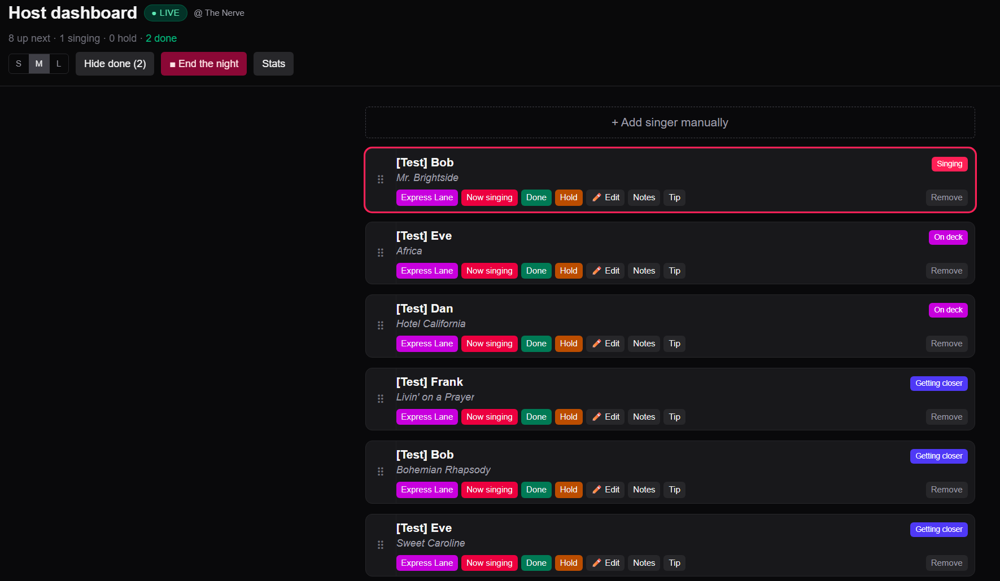

# Karaoke Queue

<p align="center">
  
</p>

A self-serve karaoke sign-up app for running a live room. Singers scan a QR taped to the speaker, drop their name + song, and watch a status tier on their phone. The host runs a private dashboard with drag-reorder, an Express Lane button, hold, lifecycle controls, private notes, tip log, and a rotation algorithm that keeps the same singer from playing back-to-back.

Built and run live for **DJ MC** at The Nerve in Haverhill, MA. See [`plan.md`](./plan.md) for the original design notes.

---

## Features

- **Blind queue.** Singers see one of three states only: *Coming Up*, *You're Up!*, *Thanks for Singing*. No numeric position, so the host can reorder freely without breaking promises.
- **Rotation algorithm.** Same singer never plays back-to-back unless they're alone in the queue. When the same person submits a second song, it lands in the next rotation; boundary smoothing handles the edge case where the same singer would end one rotation and start the next.
- **Session toggle.** A *Begin night / End the night* button on the dashboard. Sharing the QR before doors open shows a branded promo splash with upcoming shows instead of an active form.
- **Multi-night singer identity.** Each phone gets a long-lived cookie. Returning singers across nights see their entire history grouped per night, with checkmarks for songs they've sung.
- **Per-night stats.** End-the-night creates a `nights` row capturing total signups, total sung, duration (from first song started to last Done click), and minutes-per-singer. `/host/stats` shows records (biggest night ⭐, fastest pace ⚡) and a full table with inline edit + delete.
- **Mobile-first host UI.** Drag-reorder with long-press activation (250ms hold) so quick swipes scroll the list cleanly. 3-density toggle (S/M/L) lets the host fit the whole queue at a glance or zoom in for across-the-room reading.
- **Anti-flood limits.** Public submit capped at 3 active songs per device + 6 submissions per rolling hour. Login rate-limited at 5 fails per 60s per IP.
- **Atomic queue mutations.** Custom Postgres RPC with advisory locks + a self-healing collision evictor. Multiple concurrent submits/reorders can't leave the queue with duplicate or missing positions.

---

## Host dashboard

<p align="center">
  
</p>

Live status pill ("● LIVE @ The Nerve"), running totals, density toggle, manual add, lifecycle controls per row. Drag handle on the left of every row uses long-press activation on touch so scrolling doesn't accidentally reorder.

---

## Stack

- **Next.js 16** — App Router, React 19, Turbopack
- **Supabase** — Postgres with row-level security; no realtime, clients poll
- **Tailwind v4** + **dnd-kit** — drag-reorder with separate sensors for mouse vs touch
- **Bun** — package manager + script runner
- **Vercel** — deploy

---

## Setup

### 1. Supabase

1. Create a free project at [supabase.com](https://supabase.com).
2. Open the SQL Editor and run [`supabase/schema.sql`](./supabase/schema.sql). It's fully idempotent — safe to re-run after pulling future schema changes.
3. Project Settings → API → grab the **Project URL**, **anon (publishable) key**, and **service_role (secret) key**.

### 2. Env

```bash
cp .env.example .env.local
```

Required:

| Var | Notes |
|---|---|
| `NEXT_PUBLIC_SUPABASE_URL` | `https://YOUR_PROJECT_REF.supabase.co` |
| `NEXT_PUBLIC_SUPABASE_ANON_KEY` | Browser-facing key (RLS limits this to nothing on the singers table) |
| `SUPABASE_SERVICE_ROLE_KEY` | Server-only. Every API route uses this. |
| `HOST_PASSWORD` | What you'll type at `/host/login` |
| `HOST_COOKIE_SECRET` | `openssl rand -hex 32` |

Optional (branding — defaults are generic placeholders so the public repo stays template-able):

| Var | Default |
|---|---|
| `NEXT_PUBLIC_DJ_NAME` | `DJ MC` |
| `NEXT_PUBLIC_VENMO_HANDLE` | `your-venmo-handle` |
| `NEXT_PUBLIC_INSTAGRAM_HANDLE` | `your-instagram` |
| `NEXT_PUBLIC_WEBSITE` | `your-site.com` |
| `NEXT_PUBLIC_BOOKING_EMAIL` | `you@example.com` |
| `NEXT_PUBLIC_RADIO_URL` | falls back to `https://${NEXT_PUBLIC_WEBSITE}` |

### 3. Run

```bash
bun install
bun dev
```

Visit:

- `http://localhost:3000` — public splash / submit form (depends on session state)
- `http://localhost:3000/host` — host dashboard (redirects to login)

### 4. Customize the schedule

Edit [`lib/schedule.ts`](./lib/schedule.ts) — the `RESIDENCIES` array drives the "Upcoming shows" cards on the closed splash. Add an entry per recurring night:

```ts
{
  venue: "The Nerve",
  city: "Haverhill",
  dayOfWeek: 6,        // 0 = Sun, 6 = Sat
  startHour: 20,       // 24h local
  startMinute: 0,
  endLabel: "12:45 AM",
},
```

The generator merges all residencies and surfaces the next 3 chronologically.

---

## Routes

### Public

| Path | Purpose |
|---|---|
| `/` | Closed → branded splash with upcoming shows. Open → submit form (or redirects to `/me` if returning singer). |
| `/me` | Singer's full setlist across all nights, grouped per night. Active songs editable, past songs read-only with ✓ checkmarks. |
| `/s/[id]` | Legacy per-song status page (still works for shareable links). |
| `/api/s/[id]` | Read one singer (safe columns only — no notes, no position, no tip total). |
| `/api/me` | Read all songs + night metadata for the current cookie. |
| `/api/me/edit`, `/api/me/delete` | Owner-scoped edits; locked once the song is `singing` or `done`. |

### Host (password-gated via `proxy.ts` + per-route `isHostAuthed()`)

| Path | Purpose |
|---|---|
| `/host/login` | Password form. Rate-limited per IP. |
| `/host` | Active queue dashboard. Drag, lifecycle, edit, tip, notes, manual add, density toggle, Begin/End night. |
| `/host/stats` | All past nights with records + edit/delete. |
| `/api/host/queue`, `/api/host/nights` | Read endpoints. |
| `/api/host/{add,edit-singer,delete}` | Singer mutations. |
| `/api/host/{reorder,express,status,notes,tip,clear}` | Queue mutations. |
| `/api/host/{begin-night,end-night,edit-night,delete-night}` | Session + archive. |
| `/api/host/seed-test` | Clears any `[Test]` rows so the dashboard's seed button can drop fresh test data. |
| `/api/host/{login,logout}` | Auth. |

---

## Architecture notes

- **No client-side Supabase.** The browser never gets the anon key wired to the singers table — RLS revokes all anon/authenticated grants. Every read/write goes through a Next.js route using the service role. Private columns (`notes`, `queue_position`, `tip_total`) are never sent to a singer's browser.
- **Polling, not realtime.** Singer pages poll `/api/me` every 5s; the host dashboard polls every 4s. Realtime would have leaked private columns through Supabase's row-level publication.
- **Tier derivation.** Status enum is `queued | getting_closer | on_deck | singing | done | hold`. The first three are auto-derived from `queue_position` after every mutation (see [`lib/tiers.ts`](./lib/tiers.ts)). The last three are sticky host-set states. Singer-facing pages collapse all pre-`singing` states into a single "Coming Up" label so reorders don't telegraph movement.
- **Rotation algorithm.** [`lib/queue-ops.ts`](./lib/queue-ops.ts) exports a pure `computeFairOrder(rows)` that walks the queue in arrival order and drops each singer into the first rotation that doesn't already contain them. Boundary smoothing swaps rows when the same singer would end one rotation and start the next.
- **Atomic queue writes.** Renumbering happens via a `set_queue_order(ordered_ids uuid[])` Postgres function that takes a transaction-scoped advisory lock, parks every row at a negative slot, evicts any colliders sitting in `1..N` to the archive zone (`queue_position >= 1_000_000`), then writes the final positions. The `singers_queue_position_unique` constraint is `DEFERRABLE INITIALLY DEFERRED` so intermediate states don't trip it.
- **Sessions + archives.** A single-row `app_state` table holds `session_open` and `current_venue`. Begin night sets both. End night creates a `nights` row with computed stats and stamps `night_id` on every active singer. Closed-night rows live in the "archive zone" and never collide with the next active session.
- **Host auth.** Cookie is an HMAC of the issued timestamp, signed with `HOST_COOKIE_SECRET`. `proxy.ts` redirects unauth'd `/host` traffic and 401s on `/api/host/*`; every host API route *also* calls `isHostAuthed()` itself (per the Next.js 16 docs, proxy alone isn't a security boundary).
- **Anti-abuse.** Public submit gates: 3 active songs per device, 6 submissions per rolling hour, both keyed off the singer cookie. Login: 5 fails per IP in a rolling 60s lockout.

---

## Testing

Pure in-memory rotation tests, zero DB touched:

```bash
bun run test:queue
```

Ten scenarios cover one-song singers, repeat singers, mid-night state (some `done`, then more submissions), boundary cases, and a realistic 25-song night with mixed frequencies. The script exercises the same `computeFairOrder` function production uses.

For full UI testing, the host dashboard has a **Seed test queue** button (visible only when the queue is empty) that drops 11 `[Test]`-prefixed singers in one at a time over ~20 seconds with a delay between each, so you can watch the rotation rearrange live. End the night when you're done to roll them into a "test night", then delete that night from `/host/stats`.

---

## Day-of-night checklist

1. Print + laminate a single QR pointing to your app URL (the in-app tip button replaces the old "Venmo on the sign" idea).
2. Use a dynamic QR (Bitly, QR Code Generator) so you can swap the underlying URL without reprinting.
3. Before doors: hit the URL once to wake the Supabase project (free tier auto-pauses after 7 days of inactivity).
4. Open `/host` on your phone. Click **▶ Begin night**, type the venue. Status pill turns green and the splash flips to the form.
5. Drive the night — long-press the `⠿` handle on any row to drag. Use S/M/L density to fit more or zoom in.
6. End of night: **■ End the night**. Stats are locked in at `/host/stats`.

---

## Deploying to Vercel

```bash
vercel link
# Required
vercel env add NEXT_PUBLIC_SUPABASE_URL
vercel env add NEXT_PUBLIC_SUPABASE_ANON_KEY
vercel env add SUPABASE_SERVICE_ROLE_KEY
vercel env add HOST_PASSWORD
vercel env add HOST_COOKIE_SECRET
# Optional (branding / contact)
vercel env add NEXT_PUBLIC_DJ_NAME
vercel env add NEXT_PUBLIC_VENMO_HANDLE
vercel env add NEXT_PUBLIC_INSTAGRAM_HANDLE
vercel env add NEXT_PUBLIC_WEBSITE
vercel env add NEXT_PUBLIC_BOOKING_EMAIL
vercel env add NEXT_PUBLIC_RADIO_URL
vercel deploy --prod
```

Set the same vars in your local `.env.local` for dev. Use a different Supabase project + `HOST_PASSWORD` for staging vs production.

---

## License

MIT. Fork it for your own karaoke night, rename the brand, ship it.
